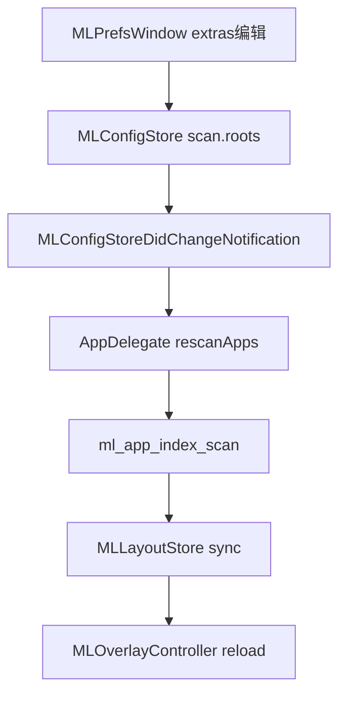

# 09 — 外部应用目录（偏好设置 + 低内存扫描）

> 在设置界面支持指定第三方/外接硬盘应用目录；扫描仍只索引 path/name，图标懒加载，符合最少内存占用。

## 1. 目标与非目标

### 目标

| 能力 | 行为 |
|------|------|
| 可配置根目录 | `config.scan.roots` 驱动扫描，不再写死三路径 |
| 偏好 UI | 列表展示额外目录；添加（选文件夹）/ 删除；即时或防抖写盘后重扫 |
| 外接盘友好 | 根不存在时静默跳过；插盘后下次扫描/定时刷新可见 |
| 低内存 | 不预加载图标；不深递归整盘；不单独建第二套 index |

### 非目标（本期不做）

- 无限深度递归整块硬盘
- 为外接盘常驻 FSEvents / DiskArbitration 自动热插拔刷新（可二期）
- 按卷 UUID 绑定（路径变更需用户重选）
- 沙盒书签（当前为非沙盒菜单栏 App；若日后沙盒再加 security-scoped bookmark）

---

## 2. 设计原则（控内存）

1. **只扩 roots，不改 `MLAppEntry` 结构** — 仍为 path / display_name / name_fold。  
2. **扫描深度与现网一致** — 根下 `*.app` + 一层子目录（如 Utilities）。  
3. **图标策略不变** — `MLIconCache` 按页懒加载，overlay 关闭 purge。  
4. **系统根固定 + 用户根追加** — UI 只编辑「额外目录」；系统三目录始终在列表前部（或作为只读基线）。  
5. **去重顺序** — roots 数组顺序即优先级；先出现者保留（与现 `add_app` 一致）。推荐顺序：

```
~/Applications
/Applications
/System/Applications
…用户额外路径（外接盘等）
```

外接与 `/Applications` 同名 app 时，若希望外接优先，把外接插在 `/Applications` 之前（高级；默认放后面更安全）。

### 内存粗估

| 增量 | 规模 |
|------|------|
| 每额外 `.app` 索引 | ~150–300 B |
| 200 个外接应用 | ~50–100 KB 常驻 |
| 图标 | 0（未进入可视页前） |

---

## 3. 数据模型 / Config

### 3.1 Schema（沿用并落实）

```json
"scan": {
  "roots": [
    "~/Applications",
    "/Applications",
    "/System/Applications",
    "/Volumes/SSD4T/Apps"
  ],
  "include_hidden": false,
  "refresh_seconds": 60
}
```

| 字段 | 说明 |
|------|------|
| `roots` | UTF-8 路径；支持 `~`；绝对路径；重复项加载时去重 |
| `include_hidden` | 本期保持 false，不扫隐藏 |
| `refresh_seconds` | 已有语义；定时 `rescanApps`（若尚未接线则一并接上） |

### 3.2 逻辑分层

| 概念 | 含义 |
|------|------|
| **Built-in roots** | 固定 3 条，UI 只读展示（可选小号灰字） |
| **Extra roots** | 用户添加；存入 `roots` 中 built-in 之后的后缀 |
| **Effective roots** | `built-in + extras`（去重、展开 `~`）→ 传给 `ml_app_index_scan` |

持久化策略（选定）：

- 磁盘上的 `scan.roots` = **完整 effective 列表**（含 built-in），便于手工改 JSON。  
- UI 编辑 extras 时：写回 `built-in + extras`。  
- 若用户删掉 JSON 里的 built-in，加载时 **补回 built-in 到前部**（容错）。

---

## 4. UI 方案（偏好窗口）

现有 [`MLPrefsWindow`](Sources/UI/MLPrefsWindow.m) 约 480×384。增加「应用目录」区块，窗口加高或改为可滚动：

**建议布局（窗口约 480×520，或 `NSScrollView`）**

```
…现有 Grid / Opacity / Hot corner…

应用目录
  系统目录（只读）
    ~/Applications
    /Applications
    /System/Applications
  额外目录
    [列表 NSTableView 或 简易 NSStackView 行]
    /Volumes/Foo/Apps                    [−]
  [+] 添加文件夹…     [立即刷新]
```

### 交互

| 操作 | 行为 |
|------|------|
| 添加 | `NSOpenPanel`：仅目录、可展开 `/Volumes`；选中后规范化为绝对路径；已存在则提示；写入 config → `scheduleSave` → 通知重扫 |
| 删除 | 从 extras 移除 → 保存 → 重扫；layout sync 会剔失效 path |
| 立即刷新 | 调用 `rescanApps`（盘刚挂上时有用） |
| 路径无效 | 列表旁灰字「未挂载」；扫描仍跳过，不弹错打断 |

中文文案建议：

- 区块标题：`应用目录`  
- 按钮：`添加文件夹…` / `移除` / `重新扫描`  
- 说明一行：`外接硬盘上的 .app 可加在这里；仅扫描该文件夹及一层子文件夹。`

---

## 5. 架构与数据流



### 模块改动

| 文件 | 改动 |
|------|------|
| [`MLConfigStore.h/.m`](Sources/System/MLConfigStore.h) | `scanRoots` 只读属性；`updateScanExtraRoots:` / 或 `addScanRoot:` `removeScanRootAt:`；load/save `scan.roots`；内置补全 |
| [`AppDelegate.m`](Sources/App/AppDelegate.m) | `rescanApps` 使用 `[config scanRootsExpanded]`；监听 config 变更中与 scan 相关时重扫；可选 timer `refresh_seconds` |
| [`MLPrefsWindow.m`](Sources/UI/MLPrefsWindow.m) | 额外目录列表 UI；OpenPanel；调用 config API |
| [`doc/06-config-schema.md`](doc/06-config-schema.md) | 补充 extras / UI 说明 |

Core `ml_app_index_scan`：**无需改逻辑**（已支持多 root + 缺目录 OK）。

---

## 6. API 草案

```objc
// MLConfigStore
@property (nonatomic, copy, readonly) NSArray<NSString *> *scanRoots; /* 完整列表，含 ~ */

+ (NSArray<NSString *> *)builtInScanRoots;

- (NSArray<NSString *> *)scanExtraRoots; /* scanRoots 去掉 built-in 后的后缀 */
- (void)setScanExtraRoots:(NSArray<NSString *> *)extras; /* 规范化、去重、写盘防抖 */
- (NSArray<NSString *> *)expandedScanRoots; /* 展开 ~，供 C API */
```

```objc
// AppDelegate
- (void)rescanApps; /* 已有：改为读 expandedScanRoots */
// 在 config didChange 时：若 scanRoots 变化则 rescanApps
```

重扫节流：连续添加多个目录时，跟随 `scheduleSave` 的 300ms，或单独 `rescan` 防抖 400ms，避免连扫。

---

## 7. 边界与错误处理

| 情况 | 处理 |
|------|------|
| 路径不存在 / 盘未挂载 | 扫描跳过；UI 标「未挂载」 |
| 选到 `/` 或 home 根 | OpenPanel 不限制太死，但可拒绝明显过宽路径（可选：警告「扫描可能较慢」） |
| 重复路径 | 忽略添加 |
| 同 stem 去重 | 先出现的 root 胜出 |
| 移除外接根后 | 重扫 → sync 剔除 layout 中失效 path → 网格更新 |
| 权限不可读 | `opendir` 失败视为空，打 NSLog |

---

## 8. 开发计划（里程碑）

### M11a — Config 接线（无 UI）

**产出**

- 读写 `scan.roots`；built-in 补全  
- `expandedScanRoots` + `AppDelegate rescanApps` 改用配置  
- 手工改 `config.json` 加外接路径即可验证  

**验收**

- JSON 增加 `/Volumes/…/Apps` 后重启（或触发 rescan）网格出现该处应用  
- 拔盘后扫描无崩溃；插盘再扫出现  

**估时**：0.5–1 天  

### M11b — 偏好 UI

**产出**

- 额外目录列表 + 添加/移除 + 重新扫描  
- 写盘 + 防抖重扫  
- 未挂载状态提示  

**验收**

- 不改 JSON，仅用 UI 完成添加/删除/刷新  
- 内存无明显跳变（Instruments：添加 100+ app 索引增量在百 KB 级）  

**估时**：1–1.5 天  

### M11c（可选）— 体验

- `refresh_seconds` 定时重扫  
- 卷挂载通知轻量刷新（`NSWorkspaceDidMountNotification`）仅触发 rescan，不建缓存  

**估时**：0.5 天  

---

## 9. 测试清单

- [ ] 仅 built-in：与现行为一致  
- [ ] 添加外接 Apps 文件夹：应用出现在末页/layout 追加  
- [ ] 同名 app：优先级符合 roots 顺序  
- [ ] 移除额外目录：应用从索引与 layout 消失  
- [ ] 未挂载路径：无崩溃、UI 有提示  
- [ ] 搜索能命中外接应用  
- [ ] 拖入文件夹 / 跨页排序后重启仍在  
- [ ] Overlay 关闭后图标缓存仍被 purge  

---

## 10. 结论

用 **`scan.roots` + 偏好里「额外目录」列表** 即可支持外接应用目录；内存成本几乎只是字符串索引。先做 M11a 打通配置，再做 M11b UI，符合「最少内存 + 可设置」要求。
